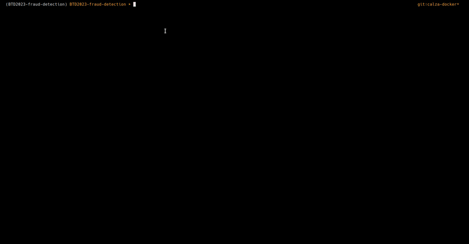

# BTD2023-fraud-detection

## Introduction

## Streamers

## Pipeline

## Data Modeling

## Database

### Add entities

## Visualization

## TODOs

### General
- [ ] Write README.md
- [x] Dockerize the software
- [ ] Write documentation
- [x] Add utils scripts:
    - [x] start/enable/stop/interrupt_streamers.sh
    - [x] add user/account/bank to cassandra
    - [x] simple interface for adding entities
- [x] start.sh for starting all pipeline

### Data Modeling
- [x] Conceptual model
- [x] Query model
    - [x] Define user stories
- [x] Logical model
- [x] Physical model

### Streamer
- [x] Start/enable/stop/interrupt streamers
- [ ] Save current streamer state to redis (e.g. config, last row sent)
- [x] Handle multiple streamers in parallel

### Pipeline
- [x] Fraud detection phase
    - [ ] Better-refine fraud-detection algorithms
        - [ ] Integrate Benford-Law for fraud detection
- [ ] Use redis as intermediate persistance layer
    - (Py)Flink missing redis connector
- [x] Update account balances real-time

### Database
- [x] Initialize Cassandra DB on docker startup
- [x] Simulate cassandra cluster with multiple nodes

### Visualization
- [x] Integrate grafana for banks generic views
- [x] Integrate user-based interface with dash
    - [x] Interact with DB via Flask defined APIs
