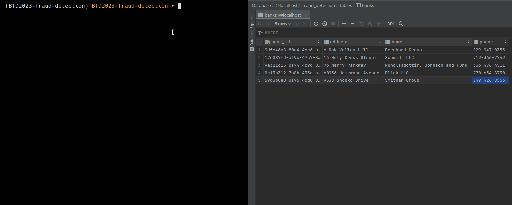

# BTD2023-fraud-detection

## Live Demo

For navigating the live demo (final [grafana dashboard](#6-visualization)), you can visit:
> URL: **[bdt.davidecalza.com](https://bdt.davidecalza.com)**
> <br />User: **guest**
> <br />Password: **BDT2023**

> **Warning** due to recently frequent disconnections from my ISP, the website may not be always reachable, since DNS cache takes some minutes to refresh after a change of my server's public IP. 

## Initial setup

The workflow requires an initial data sources location in the path:
```
./data/sources/
```
And some flink libraries in:
```
./lib/
```

The sources zip can be downloaded [here](https://drive.google.com/file/d/13Po01RVLYdbDWWEvDPSfqElstoX_aX1g/view?usp=sharing).
The lib zip can be downloaded [here](https://drive.google.com/file/d/1cBIjjZTNSo9UqNsf9Hq3LvYaWSyWuvoz/view?usp=drive_link)

Afterwards, it is sufficient to run:
```sh
./start.sh
```

The most critical parameters can be set via the proposed [config.yaml](config.yaml) file. 

> **Note**: regarding the final [grafana dashboard](#6-visualization), it is necessary to upload the provided config file **./conf/grafana.json** in the grafana after adding the cassandra and redis sources. Some queries may not be set by default in the panel, but are included in the conf.json.  

### Prerequirements

* docker
* python 3.10
```
pip install -r requirements.txt
```
> **Warning** for systems with less than 8GB of RAM, it is recommended to run only one cassandra node and set parallel processes of flink to 1. 

> **Warning** for low memory systems, it is also recommended to run flink natively instead of running the dockerized version (see [here](https://nightlies.apache.org/flink/flink-docs-master/docs/deployment/resource-providers/standalone/overview/)). The installing procedure can be found in the relative [Dockerfile](./app/pipeline/Dockerfile), and a pointer to kafka host from localhost is needed in /etc/hosts. Further tweaks may be required. 

### App Folder structure 

* The **infrastructure** lib defines a set of classes for working with the system infrastructure of the project: **kafka, cassandra, redis** <br />  

  📂**INFRASTRUCTURE** <br /> 
  ┣ 📜broker.py <br />
  ┣ 📜cache.py <br />
  ┣ 📜database.py <br />
  ┗ 📜__init__.py <br />

* The **model** lib defines a set of classes for dealing with the defined entities: **Transactions, Banks, Users, Accounts**<br /> 

  📂**MODEL** <br /> 
  ┣ 📜account.py <br />
  ┣ 📜bank.py <br />
  ┣ 📜main.py <br />
  ┣ 📜transaction.py <br />
  ┣ 📜user.py <br />
  ┗ 📜__init__.py <br />
  
* The **pipeline** lib defines a set of classes for defining and submitting the flink pipelines jobs <br /> 

  📂**PIPELINE** <br />  
  ┣ 📜Dockerfile <br />
  ┣ 📜fraud_detection.py <br />
  ┣ 📜main.py <br />
  ┣ 📜parser.py <br />
  ┣ 📜stream_entities.py <br />
  ┣ 📜stream_transactions.py <br />
  ┗ 📜__init__.py <br />

* The **stream** lib defines a set of classes for handling the data streamers <br /> 

  📂**STREAM** <br /> 
  ┣ 📜Dockerfile <br />
  ┣ 📜main.py <br />
  ┣ 📜streamer.py <br />
  ┣ 📜streamers_manager.py <br />
  ┗ 📜__init__.py <br /> 
 
* The **utils** lib defines a set of classes for general purpose tools <br /> 

  📂**UTILS** <br />
  ┣ 📜logger.py <br />
  ┗ 📜__init__.py <br />

> **Note** A more detailed documentation is provided in the code.

## 1. Introduction

The project requirement was the following:
> Create an intelligent fraud detection platform leveraging Big Data technologies. Your system would ingest transactional data from various sources (e.g., credit cards, bank accounts, investment portfolios), process unlimited events per second, perform statistical analyses of transactions, compare them against historic norms, and flag suspicious activities in milliseconds (or slightly more, well..).

The pipeline design is the following:


## 2. Data Modeling

The data modeling process was performed by following the indications proposed by
[cassandra](https://cassandra.apache.org/doc/latest/cassandra/data_modeling.html) for a correct modeling of the data structure.
> **Warning**
> data modeling for cassandra requires a **query oriented** approach, different from the typical relational data modeling.

Overall, the data modeling workflow is:
1. Define a [conceptual model](#21-conceptual-model)
2. Define a [query model](#22-query-model)
3. Merge conceptual and query models into a [logical model](#23-logical-model)
4. Derive a [physical model](#24-physical-model) from the logical


### 2.1. Conceptual Model

The conceptual model aims at defining the entities present in the data model and the relationships that may be present between each other.
This example proposes a conceptual model for a fraud detection system using the Peter Chen's entity-relationship model:


### 2.2. Query Model

The second step consists in defining a query model. This is particularly promoted by the cassandra query-oriented approach.
This consists in defining the possible end queries that the system will perform to the db, in order to provide a robust and
efficient model.

#### 2.2.1. User Stories

A preliminary step useful for defining the possible end queries is the definition of the so-called user stories:

----

* As a user, I want to see:
    * my details
    * the details of my accounts
    * all my transactions
    * the transactions of one of my accounts
    * if there are some anomalous transactions
    * the details of the transactions

----

* As a bank, I want to see:
    * my details
    * the details of the accounts
    * the details of the users
    * all transactions of the bank
    * the details of the transactions
    * all transactions of a user
    * all transactions of an account
    * all the fraudulent transactions

----

* As the fraud detector system, I want to see:
    * all transactions available
    * all transactions of a user
    * all transactions of an account
    
#### 2.2.2. Final Query Model

After the definition of the user stories, it is possible to define the query model:


### 2.3. Logical Model

Conceptual and query models are then combined into a logical model:


The definition of the logical model for Cassandra data model is a critical phase because it determines how the data will be structured and organized to fit the specific queries and data access patterns of the application.

### 2.4. Physical Model

The definition of the physical model is a simple task after the definition of a logical model:


> **Warning**
> a further refinement of the physical model is usually needed in order to define possible bucketing and partitioning techniques based on the estimated data flow. Being this project a prototype, this step has been neglected. For more information, see [here](https://cassandra.apache.org/doc/latest/cassandra/data_modeling/data_modeling_refining.html)

## 3. Streamers

In order to simulate a possible real case of real-time transactions, several streaming utilities have been included.
The concept is to add an input source (like the ones proposed in the introduction section) and stream all the data to a kafka broker, defined in the config file.
As multiple sources can be present, a streams manager is included, which will handle the different streamers using multiple threads.


The source format is not relevant, as the system was designed to provide several parsers with the aim of convert the source formats to the target one.
Parsers are part of the [flink pipeline](#4-data-processing--fraud-detection).
Each streamer stores its status (active, enabled, interrupted) in a redis cache.
Useful commands for handling the streamers are:

```sh
./stream_start.sh # Start streamers when interrupt/at the first run
```


```sh
./stream_disable.sh # Disable streamers but keep running.
```


```sh
./stream_enable.sh # Enable streamers.
```


```sh
./stream_interrupt.sh # Interrupt all streamers. Requires a new start afterwards.
```


A configuration example is the following:

```yaml
 streamers:
  - name: streamer1 # Streamer name
    file: ./data/synthetic_financial_datasets.csv # Source file to stream
    topic: raw-streamer1 # Target Kafka topic for publishing the messages
    status_key: streamer1.active # Streamer status key in the redis cache
    messages_per_second: 1 # How many messages should be sent per second
    sleep_disabled: 10 # How much time to wait for checking the status when disabled
```

## 4. Data Processing & Fraud Detection


(Py)Flink is the main player of the processing phase.
Four separate jobs are proposed for this phase:
* Transactions stream
   * Fraud detection
   * Dynamic update of accounts' balances
* New users stream
* New banks stream
* New accounts stream 

Jobs can be run by issuing the following:

```sh
docker exec -it pipeline-jobmanager flink run -py pipeline/main.py -d
```

or, if running a local flink instance, just:

```sh
flink run -py app/pipeline/main.py -d
```

> **Note** the fraud detection system relies only on a simple threshold. A further improvement may consist in the integration of Flink ML for more complex anomaly detection models, or some other statistical-based techniques, e.g. Benford's Law. 

A configuration example for the parsers is the following:

```yaml
 parsers:
  - source:
      name: synthetic_financial_datasets # source identifier
      topics: # list of topics from which listening for retrieving source messages
        - raw-streamer1
      file: ./parsers/synthetic_financial_datasets.json # json containing source types
    target:
      name: target # target identifier
      file: ./parsers/target.json # json containing target types
```

An example of a parser for the synthetic_financial_datasets is the following:
```json
{
    "step": "INT",
    "type": "STRING",
    "amount": "DOUBLE",
    "nameOrig": "STRING",
    "oldbalanceOrg": "DOUBLE",
    "newbalanceOrig": "DOUBLE",
    "nameDest": "STRING",
    "oldbalanceDest": "DOUBLE",
    "newbalanceDest": "DOUBLE",
    "isFraud": "BOOLEAN",
    "isFlaggedFraud": "BOOLEAN"
}
```

> **Note**: available types are: **[STRING, TEXT], [DOUBLE], [BOOLEAN, BOOL], [INT, INTEGER], FLOAT, FLOATTUPLE, DATE (not supported by cassandra connector, however)**.

A configuration example for entities to parse and add to the db, with the concept similar to the section for the transactions, is the following:

```yaml
entities:
  - source:
      name: bank
      topics:
        - new-bank
      file: ./parsers/bank.json
  - source:
      name: user
      topics:
        - new-user
      file: ./parsers/user.json
  - source:
      name: account
      topics:
        - new-account
      file: ./parsers/account.json
```

## 5. Database

By default, the cassandra cluster is created with 3 nodes from the docker compose.
The default database schema is depicted in section (#24-physical-model).

### 5.1. Add entities

Some functionalities have been integrated in order to add users, banks and accounts.



For accessing the interface, the command is:

```sh
./add.sh
```

The insertion process will be entirely guided.

## 6. Visualization

The final visualization consists in a grafana dashboard with several panels showing statistics, primarly grouped by different banks:


### 6.1. Interfaces

The following interfaces can be accessed:
* **Grafana Dashboard**: localhost:**3000**
* **Flink Dashboard**: localhost:**8081**
* **Kafka-UI**: localhost:**8080**
* 
More services and relative ports can be found in the docker compose file. 

### 6.2. Services

A configuration example for the services is the following:

```yaml
cassandra:
  host: cassandra-1
  port: 9042
  keyspace: fraud_detection
  username: null
  password: null

flink:
  parser:
    parallelism: 2

kafka:
  host: kafka
  port: 9092

redis:
  host: redis
  port: 6379
  accounts:
    file: ./data/accounts.csv # file to use if you want to load accounts in cache from a csv. By default they are loaded directly from cassandra.
    db: 1
  streamers:
    db: 0
```

> **Note** if you want to access these services from the local machine, change hosts into **localhost**, otherwise use names of docker containers as hosts for inter-container communication.

> **Note** don't set username and passwords for cassandra if you want to use pyflink. It does not support authentication (or, at least, we were not able to configure it) 

## TODOs

### General
- [ ] Auto download libs from gdrive with gdown
- [ ] Write README.md
- [x] Dockerize the software
- [ ] Write documentation
- [x] Add utils scripts:
    - [x] start/enable/stop/interrupt_streamers.sh
    - [x] add user/account/bank to cassandra
    - [x] simple interface for adding entities
- [x] start.sh for starting all pipeline

### Data Modeling
- [x] Conceptual model
- [x] Query model
    - [x] Define user stories
- [x] Logical model
- [x] Physical model

### Streamer
- [x] Start/enable/stop/interrupt streamers
- [ ] Save current streamer state to redis (e.g. config, last row sent)
- [x] Handle multiple streamers in parallel

### Pipeline
- [x] Fraud detection phase
    - [ ] Better-refine fraud-detection algorithms
        - [ ] Integrate Benford-Law for fraud detection
- [ ] Use redis as intermediate persistance layer
    - (Py)Flink missing redis connector
- [x] Update account balances real-time

### Database
- [x] Initialize Cassandra DB on docker startup
- [x] Simulate cassandra cluster with multiple nodes

### Visualization
- [x] Integrate grafana for banks generic views
- [x] Integrate user-based interface with dash
    - [x] Interact with DB via Flask defined APIs
